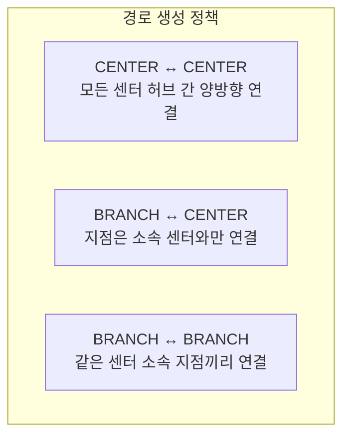
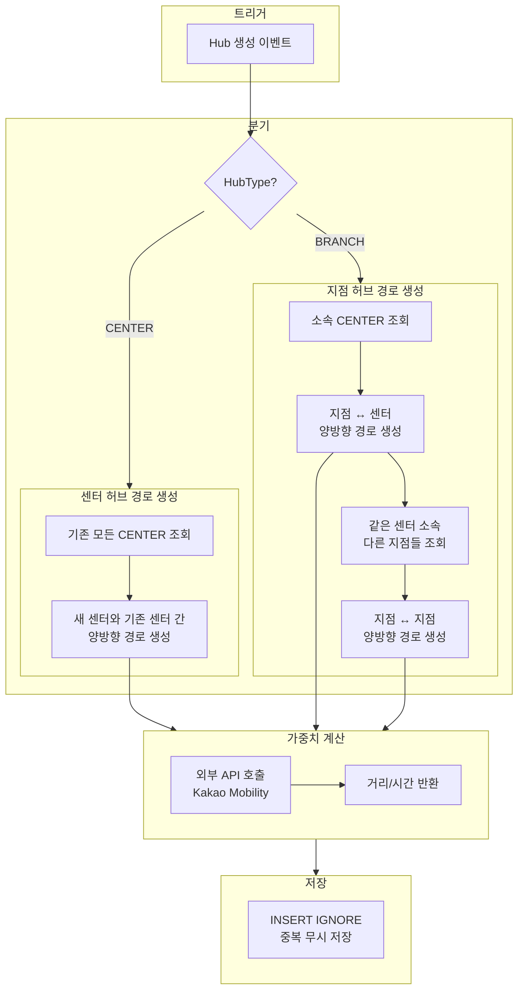
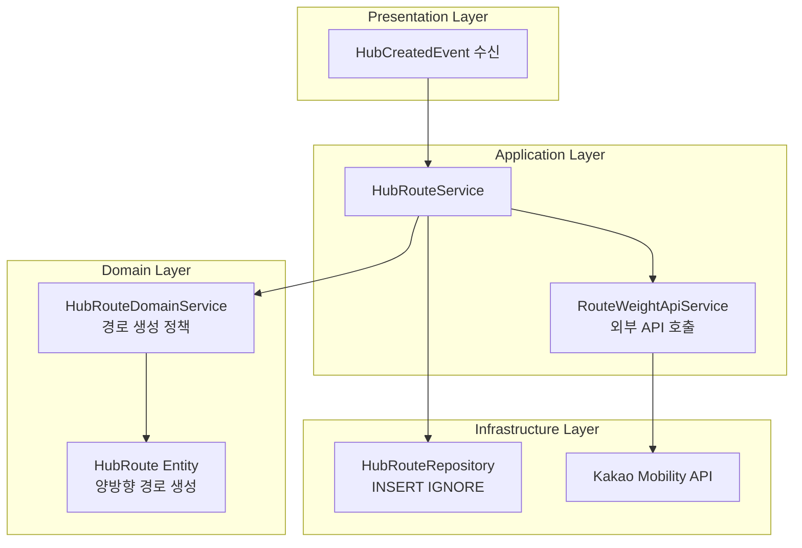
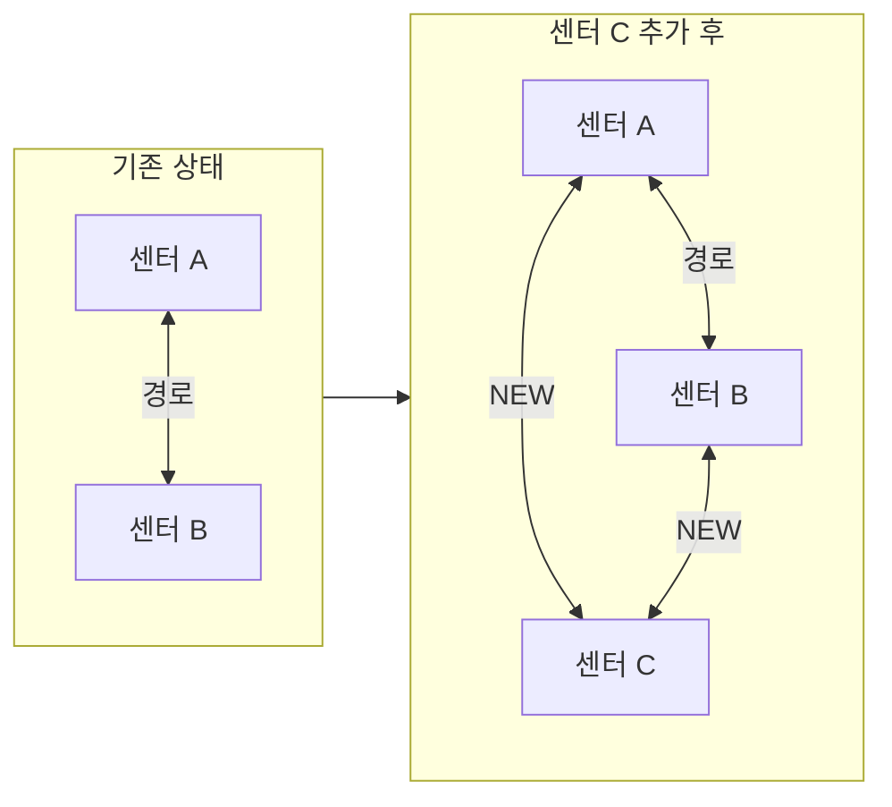
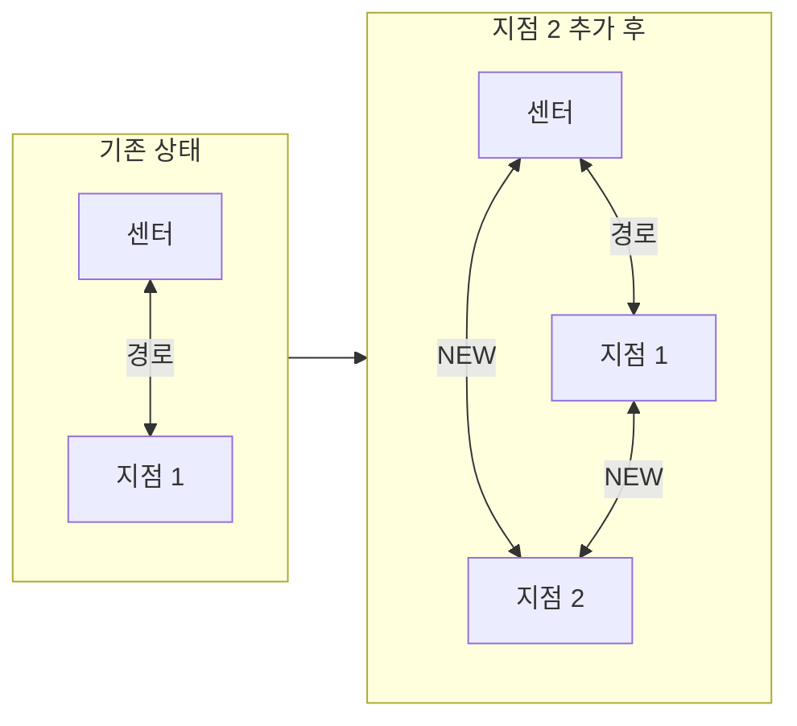

# Hub Route 생성 알고리즘

## 핵심 정책

```mermaid
flowchart TD
    subgraph Policy[" 경로 생성 정책"]
        P1["CENTER ↔ CENTER<br/>모든 센터 허브 간 양방향 연결"]
        P2["BRANCH ↔ CENTER<br/>지점은 소속 센터와만 연결"]
        P3["BRANCH ↔ BRANCH<br/>같은 센터 소속 지점끼리 연결"]
    end
```

## 전체 흐름

```mermaid
flowchart TB
    subgraph Trigger[" 트리거"]
        E1[Hub 생성 이벤트]
    end

    subgraph Routing[" 분기"]
        E1 --> TypeCheck{HubType?}
        TypeCheck -->|CENTER| CenterFlow
        TypeCheck -->|BRANCH| BranchFlow
    end

    subgraph CenterFlow[" 센터 허브 경로 생성"]
        C1[기존 모든 CENTER 조회]
        C2[새 센터와 기존 센터 간<br/>양방향 경로 생성]
        C1 --> C2
    end

    subgraph BranchFlow[" 지점 허브 경로 생성"]
        B1[소속 CENTER 조회]
        B2[지점 ↔ 센터<br/>양방향 경로 생성]
        B3[같은 센터 소속<br/>다른 지점들 조회]
        B4[지점 ↔ 지점<br/>양방향 경로 생성]
        B1 --> B2 --> B3 --> B4
    end

    subgraph Weight[" 가중치 계산"]
        W1[외부 API 호출<br/>Kakao Mobility]
        W2[거리/시간 반환]
        W1 --> W2
    end

    subgraph Save[" 저장"]
        S1[INSERT IGNORE<br/>중복 무시 저장]
    end

    C2 --> Weight
    B2 --> Weight
    B4 --> Weight
    Weight --> Save
```

## 레이어 구조

```mermaid
flowchart TB
    subgraph Presentation["Presentation Layer"]
        Event[HubCreatedEvent 수신]
    end

    subgraph Application["Application Layer"]
        Service[HubRouteService]
        API[RouteWeightApiService<br/>외부 API 호출]
    end

    subgraph Domain["Domain Layer"]
        DomainService[HubRouteDomainService<br/>경로 생성 정책]
        Entity[HubRoute Entity<br/>양방향 경로 생성]
    end

    subgraph Infra["Infrastructure Layer"]
        Repo[HubRouteRepository<br/>INSERT IGNORE]
        Kakao[Kakao Mobility API]
    end

    Event --> Service
    Service --> DomainService
    Service --> API
    DomainService --> Entity
    API --> Kakao
    Service --> Repo
```

## 센터 허브 생성 시

```mermaid
flowchart LR
    subgraph Before["기존 상태"]
        CA[센터 A]
        CB[센터 B]
        CA <-->|경로| CB
    end

    subgraph After["센터 C 추가 후"]
        CA2[센터 A]
        CB2[센터 B]
        CC[센터 C]
        CA2 <-->|경로| CB2
        CA2 <-->|NEW| CC
        CB2 <-->|NEW| CC
    end

    Before --> After
```

## 지점 허브 생성 시

```mermaid
flowchart LR
    subgraph Before["기존 상태"]
        C1[센터]
        BR1[지점 1]
        C1 <-->|경로| BR1
    end

    subgraph After["지점 2 추가 후"]
        C2[센터]
        BR1_2[지점 1]
        BR2[지점 2]
        C2 <-->|경로| BR1_2
        C2 <-->|NEW| BR2
        BR1_2 <-->|NEW| BR2
    end

    Before --> After
```