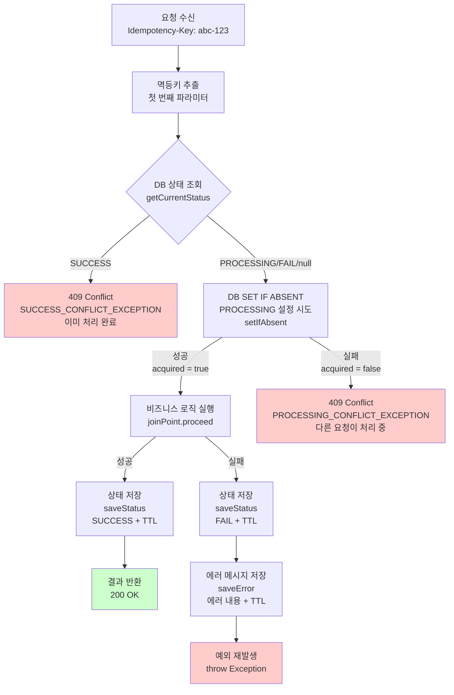

```mermaid
flowchart TD
    Start[요청 수신<br/>Idempotency-Key: abc-123] --> Extract[멱등키 추출<br/>첫 번째 파라미터]

    Extract --> GetStatus{DB 상태 조회<br/>getCurrentStatus}

    GetStatus -->|SUCCESS| Conflict1[409 Conflict<br/>SUCCESS_CONFLICT_EXCEPTION<br/>이미 처리 완료]

    GetStatus -->|PROCESSING/FAIL/null| SetNX[DB SET IF ABSENT<br/>PROCESSING 설정 시도<br/>setIfAbsent]

    SetNX -->|성공<br/>acquired = true| Execute[비즈니스 로직 실행<br/>joinPoint.proceed]
    SetNX -->|실패<br/>acquired = false| Conflict2[409 Conflict<br/>PROCESSING_CONFLICT_EXCEPTION<br/>다른 요청이 처리 중]

    Execute -->|성공| MarkSuccess[상태 저장<br/>saveStatus<br/>SUCCESS + TTL]
    MarkSuccess --> Return[결과 반환<br/>200 OK]

    Execute -->|실패| MarkFailed[상태 저장<br/>saveStatus<br/>FAIL + TTL]
    MarkFailed --> SaveError[에러 메시지 저장<br/>saveError<br/>에러 내용 + TTL]
    SaveError --> Throw[예외 재발생<br/>throw Exception]

    style Conflict1 fill:#ffcccc
    style Conflict2 fill:#ffcccc
    style Return fill:#ccffcc
    style Throw fill:#ffcccc
```