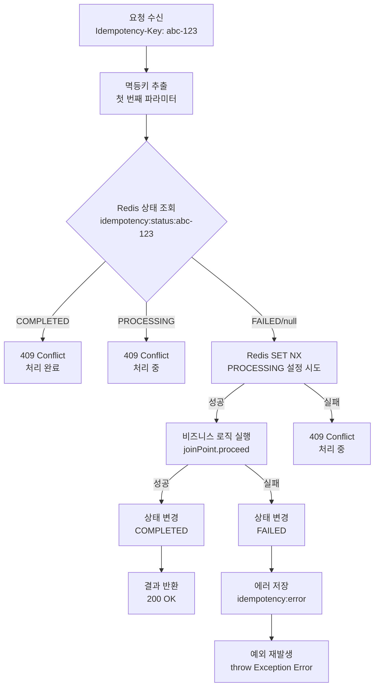

```mermaid
flowchart TD
    Start[요청 수신<br/>Idempotency-Key: abc-123] --> Extract[멱등키 추출<br/>첫 번째 파라미터]

    Extract --> GetStatus{Redis 상태 조회<br/>idempotency:status:abc-123}

    GetStatus -->|COMPLETED| GetResult[409 Conflict<br/> 처리 완료]

GetStatus -->|PROCESSING| Conflict[409 Conflict<br/> 처리 중]

GetStatus -->|FAILED/null| SetNX[Redis SET NX<br/>PROCESSING 설정 시도]

SetNX -->|성공| Execute[비즈니스 로직 실행<br/>joinPoint.proceed]
SetNX -->|실패| Race[409 Conflict<br/> 처리 중]

Execute -->|성공| MarkComplete[상태 변경<br/>COMPLETED]
MarkComplete --> Return2[결과 반환<br/> 200 OK]

Execute -->|실패| MarkFailed[상태 변경<br/>FAILED]
MarkFailed --> SaveError[에러 저장<br/>idempotency:error]
SaveError --> Throw[예외 재발생<br/> throw Exception Error]

```